# `chatgpt_expand.py` — ChatGPT/DeepSeek Expand Pipeline

Standalone landscape-discovery + Coherent Quadrant pipeline driven by an LLM's own web-search
tool (OpenAI SDK / DeepSeek chat-compatible), with an optional local Google AI Overview scraper
for extra discovery breadth.

This is a **separate, independent pipeline** from [`run_pipeline.py`](../pipeline-run_pipeline/README.md)
— it does not call it and is not called by it. Both produce the same *kind* of output (landscape
Excel + Coherent Quadrant chart), via different discovery mechanics.

This document describes the pipeline's **shape**, not any single market's run. Everywhere you see
`<Market>`, substitute the actual market you're running — nothing here is hardcoded to one market.

## How to run it

```bash
python scripts/run_chatgpt_expand.py --query "<Market>" --country <global|Country> --fresh
```

Key flags:
- `--fresh` — ignore any existing checkpoint, start clean (omit to resume a prior run)
- `--target` — company target (default: **1000**)
- `--max-fill` / `--max-queries` — discovery breadth caps
- `--scraper-url` — Google AI Overview scraper backend URL (default `http://127.0.0.1:15561`)

Every step is checkpointed (`ExpandCheckpoint`) — re-running **without** `--fresh` resumes from the
last completed step instead of starting over.

## Flowchart

```mermaid
flowchart TD
    START(["START: run_chatgpt_expand.py --query &lt;Market&gt; --fresh"]) --> S1

    subgraph S1["Step 1/6 — ChatGPT Recall"]
        direction TB
        s1a["Ask the LLM (paged, ~35/page) to list\ncompanies it already knows in this market"]
    end
    S1 --> S2

    subgraph S2["Step 2/6 — OpenAI SDK Web Search"]
        direction TB
        s2a["Live web_search tool calls discover companies\nnot in the LLM's own knowledge"]
        s2g["2g. Google AI List Discover (optional)\nQueries local scraper backend (:15561) + Chrome\nextension for AI-Overview company lists.\nNeeds GOOGLE_AI_SCRAPER_ENABLED=true, else skipped"]
        s2a --> s2g
    end
    S2 --> S3

    subgraph S3["Step 3/6 — DDGS / SearXNG Harvest (optional)"]
        direction TB
        s3a["Supplementary search-engine harvest;\nLLM-extracts company names from results"]
    end
    S3 --> S4

    subgraph S4["Step 4/6 — ChatGPT Verify (mid)"]
        direction TB
        s4a["LLM checks each candidate against strict\nmarket-fit criteria; drops resellers, media,\nassociations, geo-junk before the expensive fill step"]
    end
    S4 --> S5

    subgraph S5["Step 5/6 — Fill Gaps to Target"]
        direction TB
        s5a["5a. Search-stack fill\nGoogle AI + DDGS + SearXNG + Exa + Wikipedia + Owler"]
        s5b["5b. OpenAI SDK residual fill\nLLM fills remaining gaps directly"]
        s5a --> s5b
    end
    S5 --> S6

    subgraph S6["Step 6/6 — ChatGPT Final Verify + Trim"]
        direction TB
        s6a["Final market-fit pass on merged candidates;\ntrims to target row count (default 1000),\nranked by data confidence"]
    end
    S6 --> S6C

    subgraph S6C["Step 6c — Coherent Quadrant X / Y / Overall Scoring"]
        direction TB
        s6c1["6c.1 Player-Type Filter\nclassify_player_type(): hardware / software_service / consumer.\nDROPS every row whose role does not match:\n• hardware → Manufacturer only\n• software_service → Solution Developer / Service Provider / System Integrator only\n• consumer → Brand / Marketer only\nEverything downstream (scoring, Excel, chart) uses this filtered set"]
        s6c2["6c.2 Define Market Axes\nSame fixed titles as run_pipeline.py:\nX = 'Product Strength', Y = 'Business Strategy'\n+ 5 market-specific parameters per axis"]
        s6c3["6c.3 Deep Crawl + Score\nsmart_crawl each surviving company; LLM answers\nscoring questions; computes X/Y/Overall + quadrant"]
        s6c1 --> s6c2 --> s6c3
    end
    S6C --> S6D

    subgraph S6D["Step 6d — Company Details Mapping"]
        direction TB
        s6d1["Builds Brand | Company | Role | Quadrant | X | Y |\nOverall | Found-in table. Company column never\nblank — own name, or '(acquired by Parent)' when owned"]
    end
    S6D --> S7

    subgraph S7["Step 7 — Write Final Outputs"]
        direction TB
        s7a["Final Excel (landscape) AND HTML/CSV Quadrant\nreport — BOTH built from the same player-type-\nfiltered set from 6c.1"]
    end
    S7 --> END(["END: Final Excel (landscape)\n+ Quadrant JSON/CSV/HTML (chart)"])
```



## What each stage does

| Stage | Function / module | Purpose |
|---|---|---|
| 1/6 Recall | `run_chatgpt_expand()` — recall phase | LLM lists companies it already knows for the market |
| 2/6 Web Search | OpenAI SDK `web_search` tool | Live discovery beyond the LLM's own knowledge |
| 2g Google AI Discover | `src/vendor_intel/clients/google_ai_scraper.py` | Optional: scrapes Google AI Overview company lists via a local backend + Chrome extension |
| 3/6 DDGS/SearXNG | Optional harvest | Supplementary search-engine sourcing |
| 4/6 Mid Verify | `verify_should_keep()` / `verify_criteria_prompt()` | Drops off-market / wrong-role candidates early |
| 5/6 Fill | `web_expand.py` (search stack) + OpenAI SDK residual | Tops up toward the target row count |
| 6/6 Final Verify + Trim | Final verify pass | Confirms market fit, trims to target |
| 6c Quadrant Scoring | `src/vendor_intel/pipeline/expand_quadrant_score.py` (`score_expand_rows`) | Player-type filter → fixed axes → crawl+score → quadrant assignment |
| 6d Company Details | `expand_quadrant_score.py` (`to_company_detail_rows`) | Builds the display table via `brand_display_fields()` |
| 7 Write Outputs | `write_final_xlsx()`, `export_expand_quadrant_outputs()` | Final Excel + Quadrant JSON/CSV/HTML |

## Key defaults (as of this pipeline version)

- **Target row count**: 1000 (`target` / `max_fill`, scaled `max_queries`)
- **Fixed Quadrant axes**: X = "Product Strength", Y = "Business Strategy" — same for every market
  (shared `axis_define.py` with `run_pipeline.py`)
- **Player-type filtering applies to the WHOLE final output**, not just the chart — since `final_rows`
  is filtered in Step 6c.1 and both the Excel export and the Quadrant report are built from that same
  filtered list. A hardware market's Excel file and chart are both Manufacturer-only.
- **Company column**: never blank — same `brand_display_fields()` logic as `run_pipeline.py`

## Optional: Google AI Overview scraper backend

Step 2g is a supplementary discovery source, not required for the pipeline to run. To enable it:

```bash
# 1. Start the backend (must bind the SAME port your pipeline expects — 15561, not the
#    server's own 15551 default)
cd google-ai-scraper-main/google-ai-scraper-main/server
uv run uvicorn google_ai_scraper.app:app --port 15561

# 2. Install the Chrome extension and point its Server URL at http://localhost:15561
#    https://chromewebstore.google.com/detail/google-ai-overview-scrape/oidaeopefkgfpeigcjapebhppnbcocpc

# 3. Enable it for the pipeline
export GOOGLE_AI_SCRAPER_ENABLED=true
export GOOGLE_AI_SCRAPER_URL=http://127.0.0.1:15561
```

Without this, Step 2g silently no-ops and discovery proceeds via the other steps.

## Output locations

```
output/chatgpt_expand/<market>_<country>/
  ├── chatgpt_checkpoint_batch_all.json     ← resumable checkpoint (all step data)
  ├── chatgpt_xy_scores_batch_all.json      ← Quadrant scoring audit
  ├── <market>_<country>.xlsx               ← final landscape Excel (role-filtered)
  └── <market>_<country>_report.html        ← Quadrant chart + table
```
