# `run_pipeline.py` — Vendor Intelligence Pipeline

Quality market-landscape pipeline: **Plan → Discovery → Enrichment → Classification → Export → Coherent Quadrant**.

This document describes the pipeline's **shape**, not any single market's run. Everywhere you see
`<Market>`, substitute the actual market you're running (e.g. "Data Center Systems Market", "Avocado
Oil Market", "Semiconductor Market") — nothing in this pipeline is hardcoded to one market.

See also: [`chatgpt_expand_flowchart.pdf`](../pipeline-chatgpt_expand/chatgpt_expand_flowchart.pdf) — a
separate, independent pipeline covering the same problem via ChatGPT/DeepSeek SDK discovery.

## How to run it

```bash
python run_pipeline.py --industry "<Market>" --country <global|Country> --live
```

Key flags:
- `--country` — `global` (default) or a specific country/region
- `--profile` — `quality` (default, ~vetted), `balanced`, `recall` (bulk/noisier), `deep`
- `--live` — force live mode (real API calls, not mocks)
- `--enrich-limit` / `--classify-limit` — override the per-phase row caps (default target: **1000**)

## Flowchart

```mermaid
flowchart TD
    START(["START: run_pipeline.py --industry &lt;Market&gt;"]) --> P1

    subgraph P1["Phase 1 — Query Plan"]
        direction TB
        p1a["LLM interprets the market into a structured\nsearch plan: value-chain sections, geography\nscope, search prompt seeds"]
    end
    P1 --> P2

    subgraph P2["Phase 2 — Discovery + Entity Gate"]
        direction TB
        p2a["Search-driven candidate discovery across\nvalue-chain sections. Drops geo-artifact /\nplaceholder names and obvious duplicates"]
    end
    P2 --> P3

    subgraph P3["Phase 3 — Enrichment"]
        direction TB
        p3a["Crawls each candidate's website (smart_crawl)\nto extract HQ, founded year, revenue, YoY\ngrowth, product description, ownership"]
    end
    P3 --> P4

    subgraph P4["Phase 4 — Classification (Quality)"]
        direction TB
        p4a["LLM scores relevance / confidence / quality;\ntags commercial_role (Brand, Marketer,\nManufacturer, Solution Provider, ...)"]
    end
    P4 --> P5

    subgraph P5["Export Filter + Save Landscape"]
        direction TB
        p5a["Confidence/quality gates + per-market-family\nrole allow-list (industry_role_rules.yaml).\nRow cap target: 1000. Writes CSV + XLSX + DOCX"]
    end
    P5 --> P6

    subgraph P6["Phase 6 — Coherent Quadrant Synthesis (synthesize_quadrant)"]
        direction TB
        p6a["6a. Select Industry Catalog\nMatch market → industry_group / industry_category baseline"]
        p6b["6b. Define Market Axes\nLLM refines 5 X + 5 Y parameters for THIS market.\nAxis TITLES fixed for every market:\nX = 'Product Strength', Y = 'Business Strategy'"]
        p6c["6c. Market Relevance / Player-Type Filter\nLLM classifies market: hardware / software_service / consumer.\nKeeps ONLY the matching role:\n• hardware → Manufacturer only\n• software_service → Solution Developer / Service Provider / System Integrator only\n• consumer → Brand / Marketer only"]
        p6d["6d. Value-Chain Operator Filter\nDrops distributors/traders/resellers with no\noperational control; collapses parent/subsidiary duplicates"]
        p6e["6e. Generate Scoring Questions\nLLM writes 3 evidence-based questions per X/Y parameter"]
        p6f["6f. Score Each Company\nBuilds KB from enrichment evidence; LLM answers\nscoring questions per company"]
        p6g["6g. Normalize + Assign Quadrant\nProportional normalization; assigns Leaders /\nChallengers / Trailblazers / Emerging Players + chart position"]
        p6h["6h. Build Chart + Table\nChart: ~20 brands, balanced across 4 quadrants.\nTable: up to 1000 rows. Company column never blank —\nshows own name, or '(acquired by Parent)' when owned"]
        p6a --> p6b --> p6c --> p6d --> p6e --> p6f --> p6g --> p6h
    end
    P6 --> P7

    subgraph P7["Write Outputs"]
        direction TB
        p7a["Quadrant JSON + Companies CSV + self-contained\nHTML report (chart, scorecards, Company Details\ntable, Market Scoring Parameters panel)"]
    end
    P7 --> END(["END: CSV + XLSX + DOCX (landscape)\n+ Quadrant JSON/CSV/HTML (chart)"])
```



## What each stage does

| Stage | Module | Purpose |
|---|---|---|
| Phase 1 | `src/vendor_intel/phase1/runner.py` | LLM turns the market query into a structured plan (value-chain sections, geography, search seeds) |
| Phase 2 | `src/vendor_intel/phase2/discovery_fast.py` | Finds candidate companies via search; drops geo-artifacts and obvious junk |
| Phase 3 | `src/vendor_intel/enrichment/` | Crawls each candidate's site for facts (revenue, HQ, products, ownership) |
| Phase 4 | Pipeline classify step | LLM scores relevance/quality and tags `commercial_role` |
| Export | `src/vendor_intel/pipeline/quality_export.py` (`filter_for_export`) | Confidence/quality gates + `config/industry_role_rules.yaml` role scoping; writes CSV/XLSX/DOCX |
| Quadrant | `src/vendor_intel/quadrant/synthesize.py` (`synthesize_quadrant`) | Scores the exported landscape on the Coherent Quadrant (see sub-steps below) |

### Coherent Quadrant sub-steps (Phase 6)

| Sub-step | Module | Purpose |
|---|---|---|
| 6a Select Industry | `quadrant/industry_select.py` | Matches market to an `industry_group`/`industry_category` baseline |
| 6b Define Axes | `quadrant/axis_define.py` | **Fixed** axis titles (Product Strength / Business Strategy) for every market; **dynamic** 5 parameters per axis, LLM-generated per market |
| 6c Player-Type Filter | `quadrant/market_relevance.py` | LLM classifies market as hardware / software_service / consumer, keeps only the matching commercial role |
| 6d Operator Filter | `quadrant/value_chain_filter.py` | Drops non-operating supply-chain rows; collapses parent/subsidiary duplicates |
| 6e Question Generation | `quadrant/question_gen.py` | LLM writes 3 scoring questions per parameter |
| 6f Scoring | `quadrant/qa_scorer.py`, `quadrant/company_kb.py` | Builds a per-company knowledge base and scores it against the questions |
| 6g Normalize + Quadrant | `quadrant/matrix_rollup.py`, `quadrant/rating_map.py` | Population-scoped score normalization; quadrant + tier assignment |
| 6h Chart + Table | `quadrant/synthesize.py`, `quadrant/brand_meta.py` | Builds the balanced chart selection and the full Company Details table; Company column is never blank |

## Key defaults (as of this pipeline version)

- **Target row count**: 1000 (discover / enrich / export caps, both global and regional runs)
- **Fixed Quadrant axes**: X = "Product Strength", Y = "Business Strategy" — same for every market
- **Player-type filtering**: hardware → Manufacturer only · software/system-integration → Solution
  Developer / Service Provider / System Integrator only · everything else → Brand / Marketer only
- **Company column**: never blank — independent companies show their own name; acquired companies
  show `Company Name (acquired by Parent)`

## Output locations

```
output/pipeline/pipeline_<market>_<country>.csv       ← raw landscape export
output/pipeline/pipeline_<market>_<country>.json       ← full run summary
output/quadrant/<market-slug>_quadrant.json            ← Coherent Quadrant data
output/quadrant/<market-slug>_companies.csv            ← Quadrant company table
output/quadrant/<market-slug>_report.html              ← open this for the chart
```
