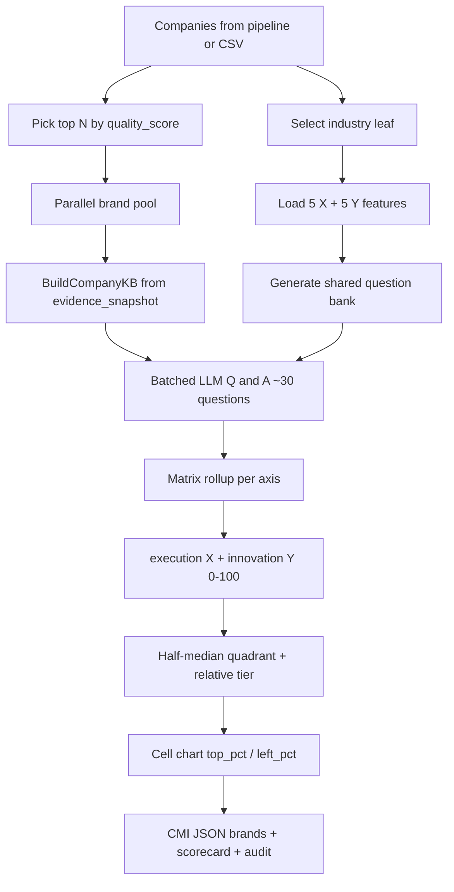

# Coherent Quadrant Agent — Architecture

This document describes the **full architecture** of the Coherent Quadrant scoring agent under `src/vendor_intel/quadrant/`.

The agent turns landscape-pipeline companies into a **CMI-shaped quadrant JSON** (brands, scorecard, criteria, questions, evidence) that the CMI frontend charts and tables consume.

---

## 1. What the agent does

For a market (e.g. *Smartphone Market*, *Avocado Oil Market*) and a list of companies:

1. Select the correct **industry leaf** (e.g. Consumer Electronics, Food Ingredients).
2. Load that leaf’s **5 X + 5 Y** evaluation features.
3. Generate a **shared question bank** (~3 questions × 10 features = ~30 questions).
4. Build a **per-brand knowledge base** from pipeline `evidence_snapshot` only (no live web search).
5. Score every question **1–10** with the LLM (KB first; model knowledge when evidence is thin).
6. Roll up scores with **Vendor Evaluation Matrix** math → `execution` (X) and `innovation` (Y) on 0–100.
7. Assign **quadrant**, **tier**, and **chart coordinates** using relative (within-cohort) rules.
8. Write `output/quadrant/<slug>_quadrant.json` for the CMI UI.

---

## 2. Place in the wider system

```text
┌──────────────────────────────────────────────────────────────────────────┐
│  Vendor-intel landscape pipeline                                         │
│  Phase1 → Discovery → Enrich → Classify → Quality export                 │
│                                                                          │
│  Each classified company carries evidence_snapshot                       │
│  (crawl text, discovery snippets, enrich INTEL, classify summary)        │
│                         │                                                │
│                         ▼                                                │
│              synthesize_quadrant(companies, scope, settings)             │
│                         │                                                │
│                         ▼                                                │
│   output/quadrant/<slug>_quadrant.json                                   │
│   output/quadrant/<slug>_questions.json                                  │
│   pipeline result["coherent_quadrant"]                                   │
└──────────────────────────────────────────────────────────────────────────┘
                         │
                         ▼
┌──────────────────────────────────────────────────────────────────────────┐
│  CMI frontend (apps/web)                                                 │
│  GET /api/quadrant?slug=&market=  →  QuaderentSection chart + tables     │
│  Reads VENDOR_INTEL_QUADRANT_DIR / output/quadrant / fixtures/quadrant   │
└──────────────────────────────────────────────────────────────────────────┘
```

### Entry points

| Entry | When to use |
|-------|-------------|
| Pipeline hook in `pipeline/orchestrator.py` | Full live run (`QUADRANT_ENABLED=true`) |
| `scripts/run_quadrant_from_pipeline_json.py` | Rerun quadrant only from existing pipeline JSON |
| `scripts/run_quadrant_from_csv.py` | Quadrant from a sectioned market-roles CSV |
| `scripts/run_quadrant_pipeline.py` | Full pipeline + quadrant report for any market |

Orchestrator call (simplified):

```python
if settings.quadrant_enabled and final:
    coherent_quadrant = await synthesize_quadrant(
        final, query_context=..., scope=..., settings=settings
    )
```

---

## 3. Module map

```text
src/vendor_intel/quadrant/
├── ARCHITECTURE.md      ← this file
├── __init__.py          ← public synthesize_quadrant()
├── synthesize.py        ← end-to-end orchestration
├── criteria_catalog.py  ← YAML industry leaves + feature weights
├── industry_select.py   ← market text → industry leaf
├── question_gen.py      ← LLM / template question bank
├── snapshot.py          ← build evidence_snapshot at classify time
├── company_kb.py        ← snapshot → KB chunks (no web search)
├── qa_scorer.py         ← grounded (+ model-knowledge) Q&A scores
├── matrix_rollup.py     ← Vendor Evaluation Matrix math
├── rating_map.py        ← ratings, quadrants, tiers, chart coords
└── schema.py            ← Pydantic CMI + audit models
```

| Module | Responsibility |
|--------|----------------|
| `synthesize.py` | Pick brands, parallel score, rollup, place, write JSON |
| `criteria_catalog.py` | Load `quadrant_industry_criteria.yaml`; feature weights |
| `industry_select.py` | Keyword / LLM / overlap → `(group, category)` |
| `question_gen.py` | One shared bank of ~30 questions per run |
| `snapshot.py` | Pack enrich + discovery + classify into `evidence_snapshot` |
| `company_kb.py` | Expand snapshot into truncated KB text for the LLM |
| `qa_scorer.py` | Batch or single-question scoring with grounding |
| `matrix_rollup.py` | `sub_avg`, `contribution`, axis → 0–100 |
| `rating_map.py` | Dot ratings, half-median quadrants, relative tiers, chart % |
| `schema.py` | `CoherentQuadrantPayload`, `QuadrantBrand`, scorecard, grounding |

### Config (source of truth)

| File | Role |
|------|------|
| `config/quadrant_industry_criteria.yaml` | Industry leaves, X/Y feature names, keyword router |
| `config/quadrant_scoring_weights.yaml` | Weights, floors, relative placement, chart mode |
| `config/prompts/quadrant_grounded_answer.txt` | Single-question scoring prompt |

### Settings / env

| Env | Default | Meaning |
|-----|---------|---------|
| `QUADRANT_ENABLED` | `true` | Run after landscape export |
| `QUADRANT_MAX_COMPANIES` | `12` | Cap brands scored (cost + UI density) |
| `QUADRANT_BRAND_CONCURRENCY` | `6` | Parallel brand Semaphore |
| `QUADRANT_QA_BATCH_MODE` | `company` | `company` / `feature` / `none` |
| `QUADRANT_WEB_SEARCH` | `false` | Ignored — KB is pipeline-only |

---

## 4. End-to-end data flow



---

## 5. Pipeline stages (detail)

### Step A — Industry selection (`industry_select.py`)

1. Keyword match on `category_keywords` (e.g. `smartphone` → Consumer Electronics).
2. If confidence &lt; 0.7 → optional LLM pick from allowed leaf list.
3. Fallback: token overlap → default leaf.

Returns: `industry_group`, `industry_category`, `x[5]`, `y[5]`, axis labels, method, confidence.

### Step B — Question generation (`question_gen.py`) — once per run

- Input: market, geography, category, 10 features.
- Output: ~3 questions per feature with weights (default `0.4 / 0.3 / 0.3`).
- **Same questions for every brand** so scores stay comparable.
- No LLM → market-templated fallback questions.

### Step C — Company knowledge base (`company_kb.py`)

Quadrant **never** calls outbound search. Chunks come only from:

1. Classify row fields (`summary`, `key_products`, `role_description`, …).
2. Inline **`evidence_snapshot`** (built at classify via `snapshot.py`):
   - Enrich INTEL (`company`, `business`, `financials`, `relationships`, `intel`, …)
   - SSC / crawl `page_text`
   - Phase-2 `discovery_snippets`
   - Classify summary / role / products

Also extracts free-text `revenue` / `yoy_growth` via regex when present.

KB is truncated to `kb_total_chars` (default 12 000) before the LLM call.

### Step D — Q&A scoring (`qa_scorer.py`)

For each brand (batched by default: **one LLM call for all questions**):

| Grounding | Meaning | Score policy |
|-----------|---------|--------------|
| `supported` | KB clearly answers | Full 1–10 from evidence |
| `partial` | Weak / incomplete KB | Full range (no hard cap) |
| `model_knowledge` | KB thin/silent; LLM uses brand/market knowledge | Full range; preferred over inventing “no evidence → 1” |
| `insufficient` | Brand truly unknown | Mid band 4–6, never 1–2 |

Config:

- `allow_model_knowledge: true`
- `score_floor: 4` — clamps very low scores when knowledge mode is on

Heuristic fallback (no LLM) also respects the floor and mid-band defaults.

### Step E — Matrix rollup (`matrix_rollup.py`)

Per feature:

```text
sub_avg       = Σ(q_weight × q_score)            # 1–10
contribution  = feature_weight × (sub_avg / 10)  # 0–feature_weight
```

Per axis:

```text
axis_overall_0_1 = Σ(contributions)
execution|innovation = round(axis_overall_0_1 × 100)   # 0–100
```

Feature weights (when `use_matrix_slot_weights: true`):

| Axis | Slot weights |
|------|----------------|
| X | `0.30, 0.20, 0.20, 0.15, 0.15` |
| Y | `0.25, 0.25, 0.20, 0.15, 0.15` |

(Otherwise equal `0.20 × 5`.)

`overall = round((execution + innovation) / 2)`.

### Step F — Placement (`rating_map.py`)

#### F1. Quadrant — `quadrant_fill_mode: half_median` (default)

Global X≈Y correlation would only fill **Leaders** and **Emerging Players**. Half-median fixes that:

1. Split cohort at the **X median**  
   - Left half → Challengers / Emerging  
   - Right half → Leaders / Trailblazers  
2. Within each half, split at that half’s **Y median**.

| Cell | Meaning (relative to peers) |
|------|-----------------------------|
| **Leaders** | High X half + higher Y within that half |
| **Trailblazers** | High X half + lower Y within that half |
| **Challengers** | Low X half + higher Y within that half |
| **Emerging Players** | Low X half + lower Y within that half |

Chart legend (Y up, X right):

```text
 Challengers          Leaders
 (low X, high Y)      (high X, high Y)
─────────────────────────────────────
 Emerging Players     Trailblazers
 (low X, low Y)       (high X, low Y)
```

Legacy absolute mode (`quadrant_fill_mode: median`) compares each brand to global midpoints only.

#### F2. Tier — `relative_tier: true` (default)

Within-cohort **rank tertiles** on `overall` (≈ top / mid / bottom third → Tier 1 / 2 / 3).

Absolute cutoffs (`≥85` / `≥70`) apply only when `relative_tier: false`.

#### F3. Chart coordinates — cell placement

With half-median, dots are placed **inside their assigned cell** so Challengers / Trailblazers are visible:

| Quadrant | `left_pct` | `top_pct` (high Y → low top) |
|----------|------------|------------------------------|
| Challengers | 8–45 | 8–45 |
| Leaders | 55–92 | 8–45 |
| Emerging Players | 8–45 | 55–92 |
| Trailblazers | 55–92 | 55–92 |

Within a cell, brands are rank-spread by X/Y; soft collision separation reduces overlap.

`criteria.midpoints` = chart crosshair (≈ 50/50 for cell mode).  
`criteria.score_midpoints` = raw score medians used for relative logic.

#### F4. Scorecard ratings

Feature `sub_avg` → `very-high` / `high` / `average` / `low` / `very-low` via `rating_thresholds`.

---

## 5A. X and Y coordinate calculation (detail)

There are **two different X/Y layers**. Tables and tooltips use the scored axis values; the chart uses CSS percentages derived from those scores after quadrant assignment.

### A. What X and Y mean (the real scores)

| Axis | JSON field | Meaning |
|------|------------|---------|
| **X** | `execution` | Solution Capability (0–100) |
| **Y** | `innovation` | Business Strategy (0–100) |

Each axis has **5 features**. Each feature has **3 questions**. The LLM scores every question **1–10**.

### B. From questions → feature score

For one feature (e.g. Product Portfolio Breadth):

```text
Q1 score = 8, weight = 0.4
Q2 score = 7, weight = 0.3
Q3 score = 6, weight = 0.3

sub_avg = (0.4×8) + (0.3×7) + (0.3×6)
        = 3.2 + 2.1 + 1.8
        = 7.1     (still on 1–10 scale)
```

Question weights are normalized if they do not sum to 1 (`weighted_question_average` in `matrix_rollup.py`).

### C. From feature → axis contribution

```text
contribution = feature_weight × (sub_avg / 10)
```

With matrix slot weights (`use_matrix_slot_weights: true`):

| Axis | Slot weights |
|------|----------------|
| X | `0.30, 0.20, 0.20, 0.15, 0.15` |
| Y | `0.25, 0.25, 0.20, 0.15, 0.15` |

Example for a feature with weight `0.30` and `sub_avg = 7.1`:

```text
contribution = 0.30 × (7.1 / 10) = 0.30 × 0.71 = 0.213
```

Do this for all 5 features on an axis, then sum:

```text
axis_overall_0_1 = Σ(contributions)     # between 0 and 1
```

### D. Scale to 0–100 (the X/Y in the company table)

```text
execution  (X) = round(axis_overall_X × 100)
innovation (Y) = round(axis_overall_Y × 100)
overall        = round((X + Y) / 2)
```

**Worked mini-example (X only):**

| Feature | weight | sub_avg | contribution |
|---------|--------|---------|--------------|
| Portfolio | 0.30 | 7.1 | 0.213 |
| Quality | 0.20 | 8.0 | 0.160 |
| R&D | 0.20 | 6.5 | 0.130 |
| Manufacturing | 0.15 | 7.0 | 0.105 |
| Regulatory | 0.15 | 5.0 | 0.075 |
| **Sum** | | | **0.683** |

```text
execution (X) = round(0.683 × 100) = 68
```

Same process independently for Y → `innovation`.

Those **X/Y numbers are absolute capability scores** from LLM Q&A + weights. They do **not** change when we place dots on the chart.

Code path: `_rollup_brand_scores` in `synthesize.py` → `feature_contribution` + `scale_to_100` in `matrix_rollup.py`.

### E. Which quadrant (Leaders / Challengers / …)

With `quadrant_fill_mode: half_median` (`assign_quadrants_half_median` in `rating_map.py`):

1. Take all brands’ **X** values → compute **median X**.
2. **Right half** (`X ≥ median`) → Leaders or Trailblazers.  
   **Left half** (`X < median`) → Challengers or Emerging.
3. Inside each half, take that half’s **Y** values → **median Y of the half**.
4. Higher Y in that half → top cell; lower Y → bottom cell.

```text
        high Y (within half)     low Y (within half)
high X   Leaders                 Trailblazers
low X    Challengers             Emerging Players
```

So quadrant is **relative to peers**, not “above absolute 50 on the chart”.

### F. Chart coordinates (`left_pct` / `top_pct`) — visual only

The UI does **not** plot raw `execution` / `innovation` as % of the full chart. After quadrant assignment, each brand is placed **inside its cell** (`chart_offsets_for_quadrants`):

| Quadrant | `left_pct` (horizontal) | `top_pct` (vertical) |
|----------|-------------------------|----------------------|
| Challengers | 8–45 | 8–45 |
| Leaders | 55–92 | 8–45 |
| Emerging Players | 8–45 | 55–92 |
| Trailblazers | 55–92 | 55–92 |

Notes:

- CSS `top` grows **downward**, so **high Y → low `top_pct`** (near the top of the chart).
- CSS `left` grows **rightward**, so **high X → high `left_pct`**.

**Inside one cell** (e.g. 3 Leaders):

1. Rank those brands by X → map ranks evenly across that cell’s `left` range.
2. Rank by Y → map so higher Y sits higher (lower `top`).
3. Tiny jitter + collision push so labels don’t stack.

Example: Samsung in Leaders with highest X and highest Y among Leaders → near **top-right of the Leaders cell** (`left` ≈ 90, `top` ≈ 8).

Frontend (`QuaderentSection`):

```text
style.left = left_pct%
style.top  = top_pct%
```

Crosshairs sit near **50% / 50%** (cell boundaries) via `criteria.midpoints`.

### G. End-to-end picture

```text
LLM Q scores (1–10)
        │
        ▼
  sub_avg per feature  = Σ(w_q × score)
        │
        ▼
  contribution         = w_feature × (sub_avg / 10)
        │
        ▼
  X = round(Σ contrib_X × 100)     ← execution  (table / tooltip)
  Y = round(Σ contrib_Y × 100)     ← innovation (table / tooltip)
        │
        ▼
  half-median → quadrant label
        │
        ▼
  left_pct / top_pct inside that cell   ← chart only
```

**Summary:**

- **X/Y scores** = weighted question → feature → axis rollup × 100.
- **Chart X/Y %** = which quadrant cell + rank within that cell (not a direct `% of execution`).

---

## 6. Parallelism & batching

```text
Semaphore(QUADRANT_BRAND_CONCURRENCY=6)
  └─ per brand: build KB → score_feature_questions_batched
       └─ qa_batch_mode=company → 1 LLM JSON call for all ~30 Qs
```

| Mode | LLM calls per brand |
|------|---------------------|
| `company` (default) | **1** |
| `feature` | ~10 |
| `none` | ~30 |

Sync LLM I/O runs in `asyncio.to_thread` so brands overlap while waiting on the provider.

Rough cost for 12 brands, company batch, concurrency 6: on the order of **1–3 minutes** wall time (provider-dependent).

---

## 7. Output JSON (`schema_version: cmi-quadrant-v1`)

```json
{
  "schema_version": "cmi-quadrant-v1",
  "market": "Smartphone Market",
  "geography": "global",
  "industry_group": "...",
  "industry_category": "...",
  "criteria": {
    "x_axis": ["Product Portfolio Breadth", "..."],
    "y_axis": ["Geographic Expansion", "..."],
    "weights": { "x": { "...": 0.3 }, "y": { "...": 0.25 } },
    "axis_labels": { "x": "Solution Capability", "y": "Business Strategy" },
    "midpoints": { "x": 50.0, "y": 50.0 },
    "score_midpoints": { "x": 58.0, "y": 59.0 }
  },
  "questions": [ { "feature": "...", "axis": "...", "items": [ { "text": "...", "weight": 0.4 } ] } ],
  "brands": [
    {
      "brand": "Samsung Electronics",
      "quadrant": "Leaders",
      "execution": 90,
      "innovation": 86,
      "top_pct": 8,
      "left_pct": 90,
      "color": "#002857",
      "tier": "Tier 1",
      "overall": 88,
      "revenue": "",
      "yoy_growth": "",
      "top_strength": "..."
    }
  ],
  "scorecard": [
    {
      "brand": "...",
      "axis": "Solution Capability",
      "criterion": "Product Portfolio Breadth",
      "rating": "high",
      "notes": "..."
    }
  ],
  "score_detail": [],
  "evidence": [],
  "meta": { "completed_at": "...", "selection": {}, "brand_count": 12 }
}
```

| Block | Consumer |
|-------|----------|
| `brands` | Chart dots + company table |
| `scorecard` | X/Y rating grids |
| `criteria` | Axis labels, weights, midpoints |
| `questions` + `score_detail` | Audit / grounding (not required by UI) |

---

## 8. Frontend wiring (CMI web)

1. Agent writes `output/quadrant/<slug>_quadrant.json`.
2. Next.js `GET /api/quadrant?slug=&market=` (`apps/web/src/app/api/quadrant/route.ts`) resolves files via:
   - `VENDOR_INTEL_QUADRANT_DIR`
   - walk-up to `output/quadrant`
   - `apps/web/fixtures/quadrant`
3. `QuaderentSection` (`pro-sections.tsx`) is data-driven:
   - Absolute overlay dots from `top_pct` / `left_pct`
   - Crosshairs from `criteria.midpoints`
   - Tables from `brands` + `scorecard`
4. Preview URL pattern:  
   `http://localhost:3005/insight/<slug>/coherent-quadrant`  
   Examples: `smartphone-market`, `avocado-oil`.

---

## 9. How to run

### Rerun from existing pipeline JSON (recommended for scoring tweaks)

```powershell
$env:PYTHONPATH = "src"
python scripts/run_quadrant_from_pipeline_json.py `
  --pipeline-json output/pipeline/pipeline_avocado_oil_market_global.json `
  --industry "Avocado Oil Market" `
  --country global `
  --max-companies 12
```

### Rerun from market CSV

```powershell
$env:PYTHONPATH = "src"
python scripts/run_quadrant_from_csv.py `
  --csv smartphones_market_global.csv `
  --industry "Smartphone Market" `
  --country global `
  --max-companies 12 `
  --prefer-section "Smartphone Brands" `
  --prefer-section "Multi-Segment"
```

### Full landscape + quadrant (any market)

```powershell
.\.venv\Scripts\python.exe scripts\run_quadrant_pipeline.py --market "<Market name>" --country global --slots 41-50
```

Requires `.env` with LLM key and `QUADRANT_ENABLED=true`.

---

## 10. Key config knobs (`quadrant_scoring_weights.yaml`)

| Key | Default | Effect |
|-----|---------|--------|
| `use_matrix_slot_weights` | `true` | Unequal feature weights (not flat 20%) |
| `allow_model_knowledge` | `true` | Score from LLM knowledge when KB is thin |
| `score_floor` | `4` | Avoid 1–2 penalties for missing crawl text |
| `relative_tier` | `true` | Tier 1/2/3 by cohort rank tertiles |
| `relative_quadrant` | `true` | Use relative midpoints / half-median |
| `quadrant_fill_mode` | `half_median` | Fill all four cells |
| `chart_placement` | `rank` | Rank-space within cells |
| `qa_batch_mode` | `company` | One LLM call per brand |
| `brand_concurrency` | `6` | Parallel brands |
| `max_companies` | `12` | Brand cap |

---

## 11. Grounding & quality guarantees

1. Prefer KB / `evidence_snippets`; if silent, use **model knowledge** — do not force low scores.
2. Revenue / YoY only when extractable; else empty + `evidence.status=unknown`.
3. Criterion names are **industry catalog strings**, not demo labels.
4. Question bank is **stable within a run** (shared across brands).
5. Quadrant and tier are **relative to the scored cohort**, so mid-score markets still get Leaders / Tier 1.
6. Chart positions follow assigned cells so Challengers and Trailblazers stay visible.

---

## 12. Failure modes

| Condition | Behavior |
|-----------|----------|
| `QUADRANT_ENABLED=false` | Stage skipped; empty dict |
| No LLM | Keyword industry + template questions + heuristic scores |
| Thin / empty KB | `model_knowledge` + `score_floor`; brand still placed |
| Brand task exception | Logged; other brands continue |
| Quadrant stage exception | Pipeline catches; `coherent_quadrant.error`; landscape export still succeeds |

---

## 13. Tests

Primary: `tests/test_quadrant_matrix.py`, `tests/test_quadrant_parallel_qa.py`

Coverage includes:

- Catalog load / industry routing  
- Matrix rollup (Vendor 1 sheet numbers)  
- Rating / quadrant / half-median fill / relative tiers  
- Chart stretch / cell placement  
- Model-knowledge floor (no forced 1–2)  
- Batch Q&A packing  

```powershell
$env:PYTHONPATH = "src"
python -m pytest tests/test_quadrant_matrix.py tests/test_quadrant_parallel_qa.py -q
```

---

## 14. Design decisions (why it works this way)

| Decision | Rationale |
|----------|-----------|
| Pipeline KB only (no quadrant search) | Cost/latency; enrich already paid for crawl |
| Shared question bank | Fair cross-brand comparison |
| Model knowledge when KB thin | Avoid all-low charts for known brands with thin crawls |
| Half-median quadrants | Correlated X≈Y would empty Challengers & Trailblazers |
| Relative tiers | Absolute 85/70 cutoffs fail on mid-score markets (e.g. avocado) |
| Cell chart placement | Visual positions match assigned quadrant labels |
| Company-batch Q&A | ~30× fewer LLM round-trips per brand |

---

## 15. Workload sketch

| Brands | Batch mode | Concurrency | Typical wall time |
|--------|------------|-------------|-------------------|
| 12 | `company` | 6 | ~1–3 min |
| 45 | `company` | 6 | ~10–20 min |
| 45 | `none` sequential | 1 | ~45–90 min |

Raise `QUADRANT_MAX_COMPANIES` only when product needs deep-score of the full list.
